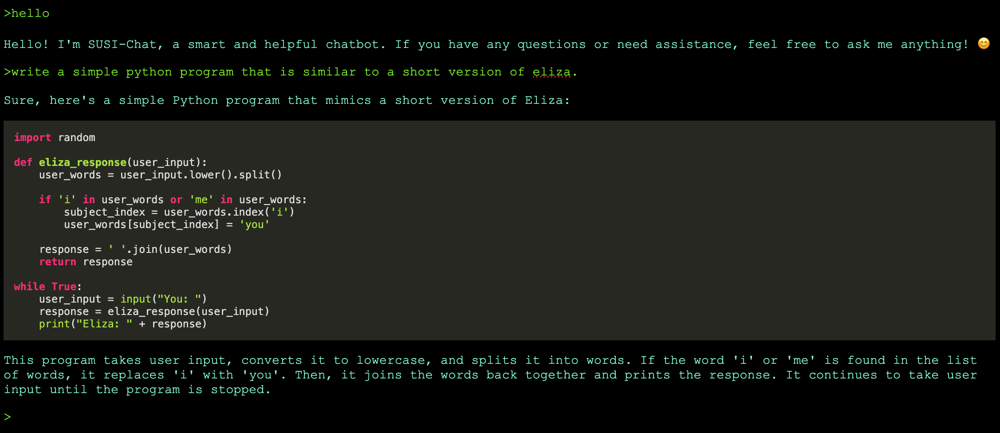

# susi_chat

We implement a chat interface to communicate with a LLM. The following ways of communication are possible:

- using a command-line console within your Linux/Mac/Windows terminal
- using a command-line console within a Browser using Javascript to simulate the same environment that you can experience with the terminal
- using a voice interface: console inputs are done via speech recognition and responses are done either on a console or using text-to-speech

All of those options shall be possible either on a normal computer or using a Raspberry Pi
which also should be able to show that the whole operation is done without internet connection.



## Running a chat server

We need a LLM as back-end for the chat. We use llama.cpp for this. Consider you have checked out the project llama.cpp in parallel to this repository, then you can do:

```
../llama.cpp/server --host 0.0.0.0 --port 8001 -ngl 0 --path ../susi_chat/chat_terminal/ -m ~/models/openchat_3.5.Q2_K.gguf
```

.. to run llama.cpp with the mixtral model hosting also susi_chat at http://localhost:8001
